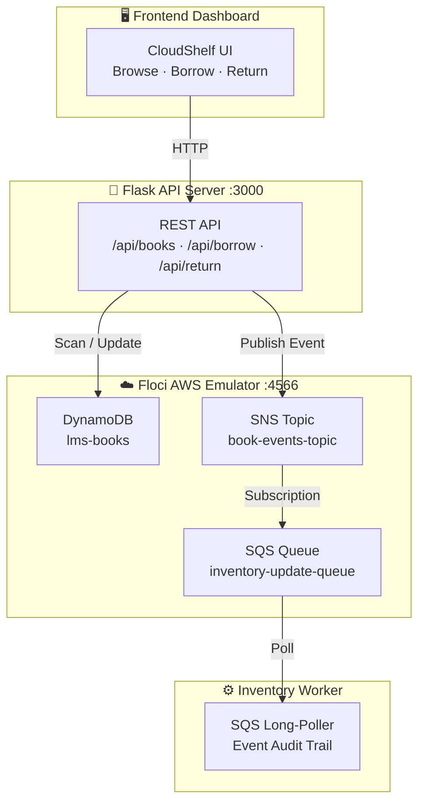

<div align="center">
  <h1>📚 CloudShelf — Library Management System</h1>
  <p><strong>A cloud-native, event-driven Library Management System built on AWS microservices, running locally via Floci.</strong></p>

  [](https://www.python.org)
  [](https://flask.palletsprojects.com/)
  [](https://www.docker.com/)
  [](https://aws.amazon.com/)
  [](https://github.com/floci-io/floci)
  [](https://developer.mozilla.org/en-US/docs/Web/HTML)
  [](https://developer.mozilla.org/en-US/docs/Web/CSS)
</div>

---

## 📖 Table of Contents
1. [Architecture & Flow](#architecture--flow)
2. [Features](#features)
3. [Project Directory Structure](#project-directory-structure)
4. [Step-by-Step Reproduction Guide](#step-by-step-reproduction-guide)
5. [Running the Application](#running-the-application)
6. [Troubleshooting & Gotchas](#troubleshooting--gotchas)
7. [Pushing to GitHub](#pushing-to-github)

---

## Architecture & Flow

This system uses a decoupled, event-driven architecture to coordinate operations between the primary API server and background inventory ledger updates.



### Event Flow Pipeline

1. **Catalog Query**: The frontend dashboard queries the `GET /api/books` REST endpoint. The Flask API scans the DynamoDB `lms-books` table and returns current book metadata, inventory states, and borrower records.
2. **Borrow/Return Mutation**: When a user inputs a borrower name and clicks **Borrow** or **Return**:
   - The Flask API validates the request, checking availability or active checkouts.
   - An atomic update is committed to DynamoDB (e.g. modifying `available_copies` and appending/removing the borrower).
   - An event message is published to the AWS **SNS topic** (`book-events-topic`).
3. **SNS to SQS Pub-Sub**: The SNS topic automatically fans out the event payload to the subscribed **SQS queue** (`inventory-update-queue`).
4. **Background Consumption**: The Python `inventory_worker.py` daemon uses long-polling (`WaitTimeSeconds=10`) to retrieve messages from SQS. It decodes the event, prints an audit entry, and deletes the processed message from the queue.

---

## Features

- **Local Cloud Emulation**: No real AWS credentials or cloud costs. Powered entirely by Floci.
- **Glassmorphism Theme**: A dark UI styling leveraging dynamic, genre-based gradient cover bands, smooth transition micro-animations, and system status indicators.
- **NoSQL Catalog Persistence**: Utilizes DynamoDB for transactional CRUD logic.
- **SQS/SNS Integration**: Implements a loose-coupling design pattern with SQS long-polling to capture events out of band.
- **Automatic Provisioning**: Floci initialization scripts hook directly into container startup to provision the DynamoDB table, SNS topic, SQS queue, subscription binding, and seed 10 classic computer science textbooks automatically.

---

## Project Directory Structure

```text
LMS-on-AWS(floci)/
├── compose.yaml              # Multi-container orchestration config
├── Dockerfile                # Python multi-process runtime environment
├── requirements.txt          # Python packages (Flask, Boto3, CORS, Dotenv)
├── .env                      # Local CLI / development configurations
├── .gitignore                # Protects data/, .env, and local virtual environments
├── local-aws-init/
│   └── 01-bootstrap.sh       # Shell script setting up AWS resources & seed data
├── src/
│   ├── aws_config.py         # Centralised Boto3 client connections
│   ├── server.py             # Flask API server & static content router
│   └── inventory_worker.py   # Background SQS daemon
└── frontend/
    ├── index.html             # Main dashboard structure
    ├── style.css              # Glassmorphic dark styling rules
    └── app.js                 # AJAX request handlers & UI mutations
```

---

## Step-by-Step Reproduction Guide

### Step 1: Initialize Files
To recreate this system, set up the project files described in the [Directory Structure](#project-directory-structure):
1. Define [compose.yaml](compose.yaml) describing the `floci` image, `lms-api` server, and `lms-worker`.
2. Construct the [local-aws-init/01-bootstrap.sh](local-aws-init/01-bootstrap.sh) containing the table schemas, SNS/SQS creation commands, and subscription steps.
3. Write the Python source files under `src/` to initialize clients pointing to `http://floci:4566` (or `localhost` for local testing) and handle web requests or queue consumption.

### Step 2: Establish the Local Network & Emulator Configuration
Configure Floci inside `compose.yaml` using:
- **`FLOCI_STORAGE_MODE=memory`**: Running the database and queue components in memory avoids file ownership/permission blockages (`Permission Denied`) during shutdown.
- **In-process Operations**: Because DynamoDB, SNS, and SQS are internal to Floci, mounting `/var/run/docker.sock` can be safely omitted.

---

## Running the Application

### 1. Bring up the containers
```bash
sudo docker compose up -d --build
```
This builds your local Flask app container, runs the SQS poller, and boots Floci. Floci will automatically invoke the ready hook to seed DynamoDB.

### 2. View the log streams
Verify that the tables and queues are active:
```bash
sudo docker compose logs -f
```

Look for confirmation logs like:
- `✅ DynamoDB table "lms-books" is ready with seed data!`
- `✅ SQS queue "inventory-update-queue" is ready!`

### 3. Open the UI
Go to [http://localhost:3000](http://localhost:3000). Try entering your name and checking out a book!

---

## Troubleshooting 

### 1. `docker: unknown command: docker compose` / `unknown shorthand flag: -d`
If your terminal returns this error while running with `sudo`, it means your Docker Compose V2 plugin is installed only within the user profile (e.g. `~/.docker/cli-plugins/`) rather than system-wide.

**Fix**: Copy the plugin binary to the global Docker plugin path:
```bash
sudo mkdir -p /usr/local/lib/docker/cli-plugins
sudo cp ~/.docker/cli-plugins/docker-compose /usr/local/lib/docker/cli-plugins/docker-compose
```

### 2. `Permission Denied` when writing storage files (.json.tmp)
If Floci is configured in `hybrid` storage mode and fails to write database state backups back to the host filesystem, it's due to directory write permissions inside Docker.

**Fix**: Use `memory` storage mode inside `compose.yaml` (as configured in this project):
```yaml
environment:
  - FLOCI_STORAGE_MODE=memory
```

---

## Pushing to GitHub

Run the following commands to initialize Git, commit your files, and push them to your repository:

```bash
# 1. Initialize repository
git init

# 2. Add your files
git add .

# 3. Create your initial commit
git commit -m "feat: initial commit of event-driven LMS on Floci"

# 4. Link your remote repository (replace with your GitHub repository URL)
git remote add origin https://github.com/YOUR_USERNAME/LMS-on-AWS.git

# 5. Rename default branch (optional but recommended)
git branch -M main

# 6. Push to GitHub
git push -u origin main
```

---

